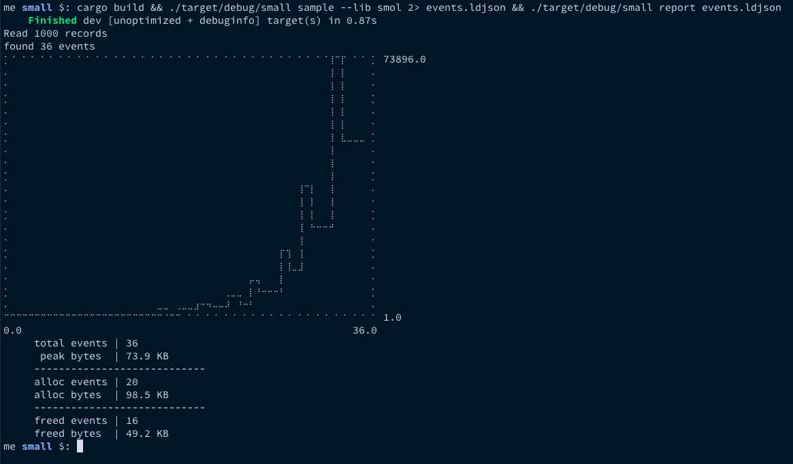

Code, following along with https://fasterthanli.me/articles/small-strings-in-rust

Put on github mostly for comparing notes.

I saw fewer allocations with SmolStr when I ran it, which is because I'm using the post-blogpost updated version of smol_str. https://github.com/rust-analyzer/smol_str/commit/633320cc7cf44b3f216c04a93eeda8e865c247ff looks like it's what explains the screenshot below:

Sidenote: simply amazing to see how fast things move, this got faster in the 16 hours between fasterthanlime posting on twitter and me trying it out.
